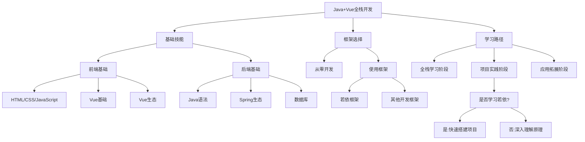
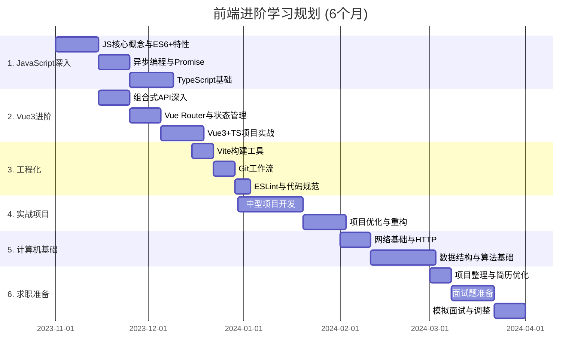

- 先说结论，若依只是一个开源的标准开发模版（和那些php的开发模版一个道理，你不需要从0开始开发，直接运行模版，然后改一些配置和细节就能光速上线了），着急开发项目的企业会用，但不建议0基础就上来学着用，因为你完全不懂原理，学了也没什么意义，你看不懂里面有哪些好的设计思想和技术栈的使用方法，再者未来可能出现更好的框架替代若依，因此推荐你先学spring boot，redis等等做做苍穹外卖、黑马点评把这些基础搞明白，有需要再去看若依；
## Java+Vue全栈开发与若依框架的关系

### 关于Java+Vue全栈开发与若依框架的思考

### 若依框架的作用与价值

若依本质上是一个**企业级快速开发平台**，它的主要作用是：

1. **提供现成解决方案**：为常见的企业应用需求（如权限管理、日志系统、代码生成等）提供开箱即用的实现
2. **加速项目开发**：避免重复造轮子，减少基础功能的开发时间
3. **展示最佳实践**：提供一种架构设计和代码组织的参考模式
4. **整合流行技术**：集成了主流的Java和Vue技术栈，展示它们如何协同工作

### 是否有必要学习若依？

这取决于你的学习目标和职业规划：

#### 适合学习若依的情况

1. **你的工作中需要使用若依**：一些公司已采用若依作为开发框架
2. **你需要快速交付企业应用**：不想从零开始开发基础功能
3. **你想了解企业级应用架构**：若依提供了一个完整的参考实现
4. **你已掌握基础技术**：有一定Java和Vue基础，想进一步提高开发效率

#### 不太适合学习若依的情况

1. **你刚开始学习编程**：若依包含复杂的架构和大量集成，可能会让初学者困惑
2. **你想深入理解技术原理**：直接使用框架可能会让你忽略底层实现
3. **你的项目需求非常特殊**：若依的通用性可能不适合高度定制化的需求

### 全栈开发应该学什么

无论是否使用若依，Java+Vue全栈开发都需要掌握以下技能：

#### 前端技能

1. **HTML/CSS/JavaScript基础**：前端三剑客是基础中的基础
2. **Vue框架**：
   - Vue基础语法、组件化开发
   - Vue Router进行路由管理
   - Vuex/Pinia状态管理
   - 组合式API (Composition API)
3. **UI框架**：
   - Element UI/Element Plus（若依使用的UI框架）
   - Ant Design Vue等流行UI库
4. **前端工程化**：
   - Webpack/Vite构建工具
   - npm/yarn包管理
   - ESLint代码规范

#### 后端技能

1. **Java基础**：语法、面向对象、集合、多线程等
2. **Spring生态**：
   - Spring Framework核心概念
   - Spring Boot自动配置和开发
   - Spring Security安全框架
   - Spring Cloud微服务（进阶）
3. **数据库技术**：
   - MySQL等关系型数据库
   - MyBatis/MyBatis-Plus ORM框架
   - Redis缓存
4. **API设计**：
   - RESTful API规范
   - Swagger文档工具

#### 全栈通用技能

1. **开发工具**：IDEA/VSCode、Git版本控制
2. **DevOps**：CI/CD、Docker容器化
3. **软件设计**：设计模式、代码重构、系统架构

### 若依在学习路径中的定位

我的建议是：

1. **先掌握基础技术**：确保对Java和Vue的核心概念有扎实理解
2. **从小项目入手**：先独立完成小型全栈应用，理解前后端交互
3. **再学习若依**：当基础牢固后，可以通过若依学习企业级应用的架构和最佳实践
4. **取其精华**：学习若依的架构思想和设计模式，而不只是会使用

### 结论

若依不是学习Java+Vue全栈开发的必经之路，但它是一个很好的企业级应用参考。对于全栈开发者而言，若依的价值在于：

1. **提供一种思路**：展示如何组织复杂的企业级应用
2. **节省开发时间**：避免从零开始开发通用功能
3. **学习最佳实践**：借鉴其中的架构设计和技术集成方案

最重要的是，无论是否选择学习若依，都应该首先打好技术基础，理解核心概念，然后再考虑使用框架来提高开发效率。框架只是工具，真正的能力在于理解并灵活运用技术解决问题。

### 前端学习路线
