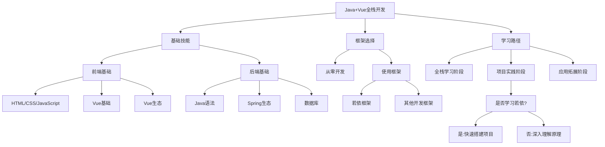
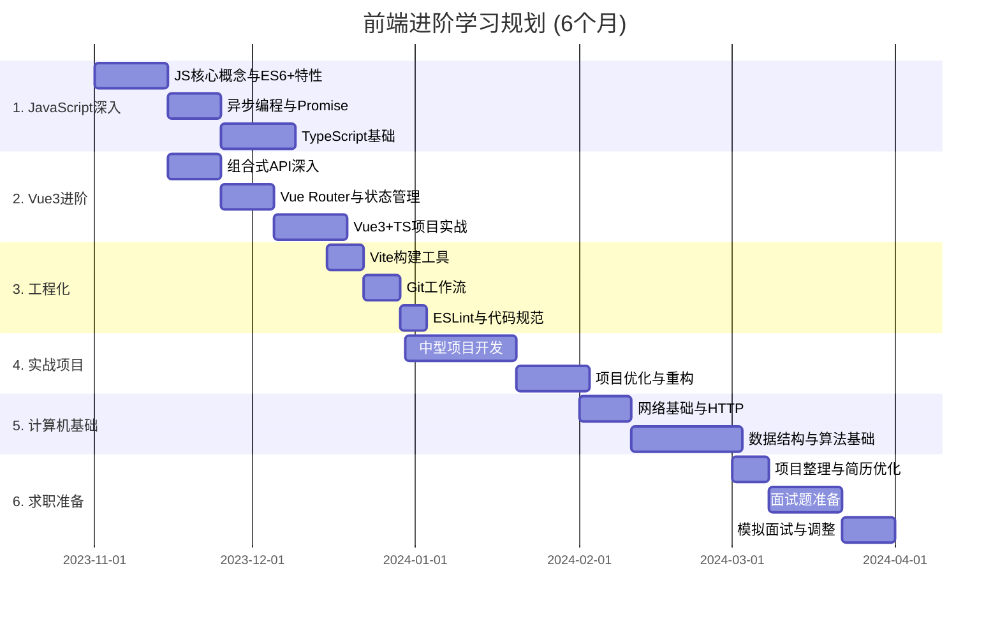

- 先说结论，若依只是一个开源的标准开发模版（和那些php的开发模版一个道理，你不需要从0开始开发，直接运行模版，然后改一些配置和细节就能光速上线了），着急开发项目的企业会用，但不建议0基础就上来学着用，因为你完全不懂原理，学了也没什么意义，你看不懂里面有哪些好的设计思想和技术栈的使用方法，再者未来可能出现更好的框架替代若依，因此推荐你先学spring boot，redis等等做做苍穹外卖、黑马点评把这些基础搞明白，有需要再去看若依；
## Java+Vue全栈开发与若依框架的关系



### 关于Java+Vue全栈开发与若依框架的思考

### 若依框架的作用与价值

若依本质上是一个**企业级快速开发平台**，它的主要作用是：

1. **提供现成解决方案**：为常见的企业应用需求（如权限管理、日志系统、代码生成等）提供开箱即用的实现
2. **加速项目开发**：避免重复造轮子，减少基础功能的开发时间
3. **展示最佳实践**：提供一种架构设计和代码组织的参考模式
4. **整合流行技术**：集成了主流的Java和Vue技术栈，展示它们如何协同工作

### 是否有必要学习若依？

这取决于你的学习目标和职业规划：

#### 适合学习若依的情况

1. **你的工作中需要使用若依**：一些公司已采用若依作为开发框架
2. **你需要快速交付企业应用**：不想从零开始开发基础功能
3. **你想了解企业级应用架构**：若依提供了一个完整的参考实现
4. **你已掌握基础技术**：有一定Java和Vue基础，想进一步提高开发效率

#### 不太适合学习若依的情况

1. **你刚开始学习编程**：若依包含复杂的架构和大量集成，可能会让初学者困惑
2. **你想深入理解技术原理**：直接使用框架可能会让你忽略底层实现
3. **你的项目需求非常特殊**：若依的通用性可能不适合高度定制化的需求

### 全栈开发应该学什么

无论是否使用若依，Java+Vue全栈开发都需要掌握以下技能：

#### 前端技能

1. **HTML/CSS/JavaScript基础**：前端三剑客是基础中的基础
2. **Vue框架**：
   - Vue基础语法、组件化开发
   - Vue Router进行路由管理
   - Vuex/Pinia状态管理
   - 组合式API (Composition API)
3. **UI框架**：
   - Element UI/Element Plus（若依使用的UI框架）
   - Ant Design Vue等流行UI库
4. **前端工程化**：
   - Webpack/Vite构建工具
   - npm/yarn包管理
   - ESLint代码规范

#### 后端技能

1. **Java基础**：语法、面向对象、集合、多线程等
2. **Spring生态**：
   - Spring Framework核心概念
   - Spring Boot自动配置和开发
   - Spring Security安全框架
   - Spring Cloud微服务（进阶）
3. **数据库技术**：
   - MySQL等关系型数据库
   - MyBatis/MyBatis-Plus ORM框架
   - Redis缓存
4. **API设计**：
   - RESTful API规范
   - Swagger文档工具

#### 全栈通用技能

1. **开发工具**：IDEA/VSCode、Git版本控制
2. **DevOps**：CI/CD、Docker容器化
3. **软件设计**：设计模式、代码重构、系统架构

### 若依在学习路径中的定位

我的建议是：

1. **先掌握基础技术**：确保对Java和Vue的核心概念有扎实理解
2. **从小项目入手**：先独立完成小型全栈应用，理解前后端交互
3. **再学习若依**：当基础牢固后，可以通过若依学习企业级应用的架构和最佳实践
4. **取其精华**：学习若依的架构思想和设计模式，而不只是会使用

### 结论

若依不是学习Java+Vue全栈开发的必经之路，但它是一个很好的企业级应用参考。对于全栈开发者而言，若依的价值在于：

1. **提供一种思路**：展示如何组织复杂的企业级应用
2. **节省开发时间**：避免从零开始开发通用功能
3. **学习最佳实践**：借鉴其中的架构设计和技术集成方案

最重要的是，无论是否选择学习若依，都应该首先打好技术基础，理解核心概念，然后再考虑使用框架来提高开发效率。框架只是工具，真正的能力在于理解并灵活运用技术解决问题。

### 前端学习路线(从AgumentCode对话中复制的)

```mermaid
graph TD
    A[前端入门] --> B[HTML/CSS基础]
    A --> C[JavaScript基础]
    A --> D[开发工具]
    
    B --> B1[HTML5语义化标签]
    B --> B2[CSS3新特性]
    B --> B3[响应式设计]
    B --> B4[Flex/Grid布局]
    
    C --> C1[ES6+语法]
    C --> C2[DOM操作]
    C --> C3[异步编程]
    C --> C4[网络请求]
    
    D --> D1[VSCode]
    D --> D2[Chrome DevTools]
    D --> D3[Git版本控制]
    D --> D4[包管理工具]
    
    E[前端进阶] --> F[前端框架]
    E --> G[工程化工具]
    E --> H[性能优化]
    E --> I[跨端开发]
    
    F --> F1[React生态]
    F --> F2[Vue生态]
    F --> F3[TypeScript]
    
    G --> G1[Webpack/Vite]
    G --> G2[Babel]
    G --> G3[ESLint/Prettier]
    
    H --> H1[性能指标]
    H --> H2[加载优化]
    H --> H3[渲染优化]
    
    I --> I1[小程序开发]
    I --> I2[React Native]
    I --> I3[Electron]
    
    J[大厂进阶] --> K[计算机基础]
    J --> L[高级技术栈]
    J --> M[系统设计]
    J --> N[软技能]
    
    K --> K1[数据结构算法]
    K --> K2[计算机网络]
    K --> K3[浏览器原理]
    
    L --> L1[Node.js全栈]
    L --> L2[微前端]
    L --> L3[低代码平台]
    
    M --> M1[组件设计]
    M --> M2[架构设计]
    M --> M3[工程化体系]
    
    N --> N1[技术沟通]
    N --> N2[项目管理]
    N --> N3[持续学习]

```

```
前端开发学习路线（面向中国IT就业市场）
一、入门阶段
1. HTML/CSS基础
HTML5基础：语义化标签、表单元素、多媒体标签
CSS3基础：选择器、盒模型、定位、动画、过渡效果
布局技术：Flex布局、Grid布局
响应式设计：媒体查询、移动优先设计
CSS预处理器：Sass/Less（了解即可）
2. JavaScript基础
核心概念：变量、数据类型、运算符、条件语句、循环
函数：声明、表达式、箭头函数、作用域、闭包
对象与原型：对象创建、原型链、继承
ES6+特性：let/const、解构赋值、模板字符串、Promise
DOM操作：选择元素、修改内容、事件处理
异步编程：回调函数、Promise、async/await
网络请求：Fetch API、Axios
3. 开发工具
编辑器：VSCode（必学）
浏览器开发工具：Chrome DevTools
版本控制：Git基础命令、GitHub/Gitee使用
包管理工具：npm/yarn/pnpm
二、进阶阶段
1. 前端框架（二选一深入）
Vue生态
Vue3核心概念：组合式API、响应式系统
Vue Router：路由管理
Pinia/Vuex：状态管理
常用UI库：Element Plus、Ant Design Vue
React生态
React核心概念：组件、Hooks、虚拟DOM
React Router：路由管理
Redux/Mobx：状态管理
常用UI库：Ant Design、Material UI
2. TypeScript
类型系统、接口、泛型
与Vue/React结合使用
类型声明文件编写
3. 工程化工具
构建工具：Webpack、Vite
代码规范：ESLint、Prettier
自动化测试：Jest、Vitest
CI/CD基础：GitHub Actions、Jenkins
4. 性能优化
关键渲染路径优化
资源加载优化（懒加载、预加载）
代码分割与缓存策略
性能监控与分析
5. 跨端开发（选学）
小程序开发（微信、支付宝）
React Native / Flutter
Electron桌面应用
三、大厂进阶
1. 计算机基础
数据结构与算法：LeetCode刷题（至少100题）
计算机网络：HTTP/HTTPS、TCP/IP、WebSocket
浏览器原理：渲染过程、JavaScript引擎、垃圾回收
2. 高级技术栈
Node.js全栈开发：Express/Koa、数据库操作
微前端：qiankun、single-spa
低代码平台：原理与实现
前端安全：XSS、CSRF防御
3. 系统设计能力
大型前端应用架构设计
组件库设计与开发
前端工程化体系建设
性能优化体系
4. 软技能
技术文档写作
技术方案沟通
项目管理与团队协作
持续学习能力
学习建议与资源
入门阶段资源
在线学习平台：
慕课网、极客时间、拉勾教育
B站优质前端教程（黑马程序员、尚硅谷）
掘金、CSDN技术社区
推荐书籍：
《JavaScript高级程序设计》
《你不知道的JavaScript》系列
《CSS新世界》
实战提升
项目实战：
仿写知名网站（如京东、淘宝）
开发个人博客系统
参与开源项目
面试准备：
刷算法题（LeetCode）
整理前端面试题库
参加模拟面试
求职准备
简历优化：
突出项目经验和技术栈
强调解决的技术难点
展示GitHub/Gitee项目
面试技巧：
准备项目介绍（STAR法则）
掌握常见面试题
了解目标公司技术栈
目标公司：
大厂：阿里、腾讯、字节跳动、百度、美团
中厂：京东、网易、滴滴、快手、小米
外企：微软、亚马逊、Shopee
中国特色就业建议
城市选择：
一线城市：北京、上海、深圳、杭州（机会多、竞争激烈）
新一线城市：成都、武汉、西安（机会与生活平衡）
行业选择：
互联网大厂（稳定性较好）
金融科技（薪资较高）
企业服务（发展潜力大）
电商平台（需求稳定）
差异化竞争：
掌握小程序开发（国内特色）
了解低代码平台开发
具备全栈能力（Node.js + 前端）
有大型项目性能优化经验
这份学习路线是根据中国IT就业市场特点定制的，遵循循序渐进的原则，从基础到进阶，最终达到能够进入中大厂的技术水平。记住，前端技术更新快，持续学习的能力比单纯掌握某项技术更重要。
```

```
前端进阶学习规划（基于当前基础）
现状分析
你已掌握：
HTML/CSS基础
JavaScript基础知识
Vue3入门知识
六个月学习规划
第1-2周：JavaScript深入学习
目标：巩固JS核心概念，掌握ES6+特性
每日2小时学习内容：
变量提升、作用域链、闭包
ES6+：let/const、解构赋值、箭头函数
模板字符串、扩展运算符
数组和对象的新方法
实践任务：
用ES6+重构一个小项目
完成5个JS编程练习题
学习资源：
《ES6标准入门》（阮一峰）
掘金ES6系列文章
B站尚硅谷ES6教程
第3-4周：异步编程与Promise
目标：掌握JavaScript异步编程模式
每日2小时学习内容：
回调函数与回调地狱
Promise基础与链式调用
async/await语法
异步编程实战
实践任务：
实现一个基于Promise的图片预加载功能
用async/await重构现有异步代码
学习资源：
MDN Promise文档
《JavaScript异步编程》
掘金异步编程专栏
第5-7周：TypeScript基础
目标：掌握TypeScript核心概念
每日2小时学习内容：
基本类型与类型注解
接口与类型别名
类与继承
泛型与高级类型
装饰器
实践任务：
将一个JS小项目转换为TS
编写5个TS练习题
学习资源：
TypeScript官方文档
《TypeScript编程》
B站TypeScript教程
第8-9周：Vue3深入学习
目标：深入理解Vue3组合式API
每日2小时学习内容：
setup函数与组合式API
响应式系统原理
生命周期钩子
自定义hooks
组件通信高级模式
实践任务：
开发3个自定义hooks
用组合式API重构一个选项式API组件
学习资源：
Vue3官方文档
《Vue.js设计与实现》
掘金Vue3专栏
第10-11周：Vue Router与状态管理
目标：掌握Vue生态系统核心工具
每日2小时学习内容：
Vue Router 4路由配置与导航守卫
Pinia状态管理
持久化存储
权限控制
实践任务：
实现一个带权限控制的路由系统
用Pinia管理应用状态
学习资源：
Vue Router与Pinia官方文档
B站相关教程
掘金实战文章
第12-14周：Vue3+TS项目实战
目标：将Vue3与TypeScript结合使用
每日2-3小时学习内容：
Vue3+TS项目搭建
类型定义与接口设计
组件类型声明
API调用与类型处理
实践任务：
开发一个Vue3+TS的Todo应用
实现类型安全的API调用
学习资源：
Vue3+TS官方文档
掘金Vue3+TS实战文章
GitHub优质开源项目
第15-16周：前端工程化
目标：掌握现代前端工程化工具
每日2小时学习内容：
Vite构建工具
Git版本控制与工作流
ESLint与Prettier代码规范
自动化测试入门
实践任务：
配置一个完整的Vite+ESLint+Prettier项目
编写Git工作流规范文档
学习资源：
Vite官方文档
《Git Pro》
掘金工程化文章
第17-21周：中型项目实战
目标：综合运用所学知识开发一个完整项目
每日3-4小时开发：
需求分析与技术选型
项目架构设计
组件设计与开发
API对接
测试与部署
项目建议：
后台管理系统
电商网站前端
社交媒体应用
技术栈：Vue3 + TS + Vite + Pinia + Element Plus
第22-24周：项目优化与重构
目标：提升项目质量与性能
每日2-3小时学习内容：
性能优化技巧
代码重构与设计模式
组件抽象与复用
错误处理与日志
实践任务：
对已完成项目进行性能优化
编写性能优化报告
学习资源：
《重构：改善既有代码的设计》
掘金性能优化文章
Chrome DevTools性能分析
第25-27周：计算机基础补充
目标：补充前端开发必备的计算机基础知识
每日2小时学习内容：
HTTP/HTTPS协议
浏览器渲染原理
数据结构基础
算法入门（排序、查找）
实践任务：
完成10道LeetCode简单题
分析一个网站的网络请求
学习资源：
《图解HTTP》
《学习JavaScript数据结构与算法》
LeetCode中国
第28-30周：求职准备
目标：准备面试，提高求职成功率
每日2-3小时准备：
项目整理与亮点提炼
简历优化
前端面试题准备
模拟面试练习
实践任务：
制作个人技术博客或GitHub项目集
参加3次模拟面试
学习资源：
《剑指Offer》
掘金面试题合集
牛客网前端面经
日常学习建议
时间分配
工作日：每天至少2小时专注学习
早晨30分钟：复习前一天内容
晚上1.5小时：学习新内容并实践
周末：每天4-6小时
上午：学习新内容
下午：项目实践
晚上：总结与复习
学习方法
理论结合实践：每学习一个知识点，立即通过代码实践
项目驱动学习：围绕项目需求学习相关技术
记录与分享：建立学习笔记，定期在技术社区分享
定期复习：每周末回顾本周所学内容
寻找学习伙伴：加入前端学习社群，互相督促
学习资源推荐
在线课程：
慕课网Vue3+TS实战课程
极客时间前端进阶专栏
B站尚硅谷/黑马程序员Vue3教程
技术社区：
掘金
思否
GitHub
书籍：
《Vue.js设计与实现》（霍春阳）
《TypeScript编程》
《JavaScript高级程序设计》
阶段性检验
第一个月结束：能够熟练使用ES6+特性和Promise
第二个月结束：能够用Vue3+TS开发简单应用
第三个月结束：掌握前端工程化工具链
第四个月结束：完成一个中型项目的开发
第五个月结束：掌握基本的性能优化技巧和计算机基础知识
第六个月结束：准备好面试材料，能够应对中级前端面试
调整建议
根据学习进度和掌握情况，灵活调整学习计划
如果某个知识点特别难，可以适当延长学习时间
保持学习热情，避免倦怠，必要时可以短暂休息调整
这份学习规划基于你当前的基础，循序渐进地引导你在六个月内达到前端中级水平，为进入中大厂打下坚实基础。坚持执行这个计划，相信你能够取得显著进步！

```
