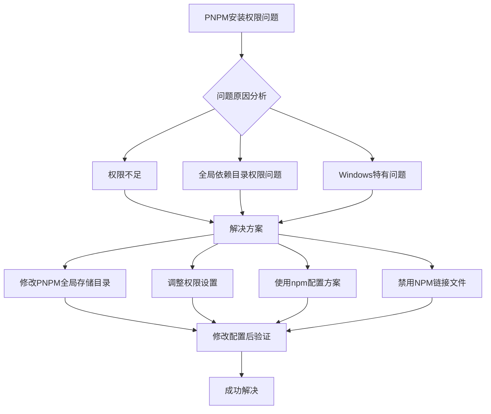
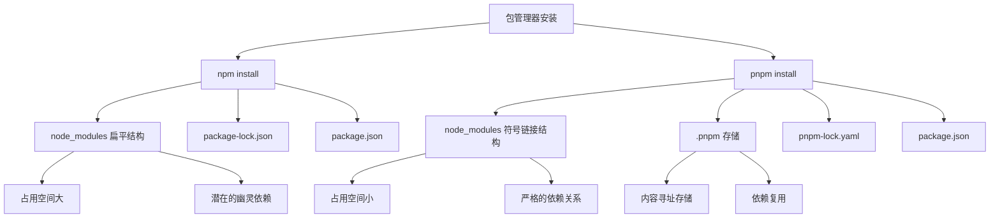
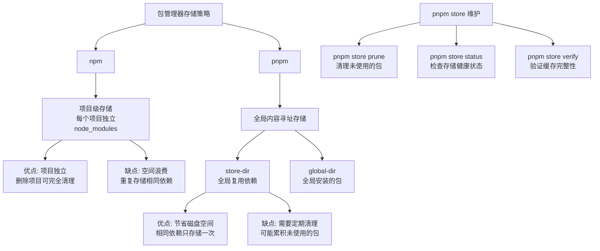

##  TS、JS、ES
- ECMAScript 是由Ecma国际（前身为欧洲计算机制造商协会）制定语言标准规范，而不是具体的编程语言，是 JavaScript 等语言的规范标准，定义了这些语言应该如何实现和工作。主要组成如下：

  > -   语法
  > -   类型
  > -   语句
  > -   关键字
  > -   保留字
  > -   操作符
  > -   全局对象

  `JavaScript`实现了`ECMAScript`，而`Adobe ActionScript`同样也实现了`ECMAScript`，只要你想，也可以构建一门脚本语言如`XXScript`来实现`ECMAScript`
  - ES6是ECMAScript的第六个版本，也称为ECMAScript 2015（之后每年发布一个新版本），是JavaScript的一个重要的更新，增加了很多新特性，如箭头函数、类、模块、Promise等。目前，ES6已经成为了JavaScript的主流标准，也是大多数浏览器和Node.js的默认支持的标准。

-  JavaScript在实现ES的基础上拓展。完整的JavaScript实现包含以下几个部分:
   -   核心（ECMAScript）
   -   文档对象模型（DOM）
   -   浏览器对象模型（BOM）
- Why TS
  - JS是弱类型语言，允许隐式类型转换；在js中有三种申明变量的方式，var、let、const，
    - var是函数作用域，申明的变量可修改，可重复申明；
    - let和const是块作用域
      - const申明的变量不可修改，不可重复申明；
      - let申明的变量不可重复申明，可重新赋值修改，并且变量的数据类型是可以改变的；
  - JS动态类型的自由性经常导致错误，这不仅降低了开发人员的效率，而且由于添加新代码行的开销增加而使开发变得很费劲。因此，由于缺乏类型和编译时错误检查，JavaScript 对于组织和大型代码库中的服务器端代码来说是一个糟糕的选择。于是TypeScript 由科技巨头微软于 2012 年开发，其创建的真正目的是处理大型应用程序：利用静态类型早检测错误、更快地完成开发、提升可拓展、维护性。
  - TS是强类型，不允许隐式类型转换，数据类型需要显式转换，编译时严格检查
    - 变量的数据类型是不隐性改变，一旦改变就会报错，以提高代码的可维护性和可靠性
    - 对于一些可能出现的错误（即使其实并没有错），ts也会警告、报错；
      - 如果希望避免这种情况，可以是使用类型断言
      ```ts
      let numArr=[1,2,3];
      const result=numArr.find((item)=>item>2);
      console.log(result*5); //由于result的确有没找到数字的情况，所有运行直接报错：“result”可能为“未定义”。

      //但我们很清楚，result是有值的，所以我们可以这样写
      const result=numArr.find((item)=>item>2) as number;

          
      ```
- What is TS
  - TypeScript是JavaScript的超集(Superset)，通过引入强类型系统来提高代码的可维护性和可靠性
    - 超集是指一个集合包含另一个集合的所有元素，并且还有其他额外的元素。
    - TypeScript = JavaScript + 类型系统 + 其他增强特性
  - TypeScript完全兼容JavaScript，所有合法的JavaScript代码都是合法的TypeScript代码;JavaScript 的库也兼容 TypeScript
  - 浏览器只认识js，TypeScript 项目要想运行，必须先转为 JavaScript 代码，这个代码转换的过程就叫做“编译”
  -  TypeScript本质上是给JavaScript添加了一个类型系统，通过编译器转换成普通JavaScript运行。它的目标是使JavaScript开发更加健壮和高效。
     -  避免隐藏隐形错误
     -  易于重构代码
-  TS Vs JS

  | 特性 | TypeScript | JavaScript |
  |---|---|---|
  | 语法 | 静态类型注解，类和接口定义，枚举类型，装饰器等 | 基本的面向对象语法，原型链继承，匿名函数等 |
  | 类型系统 | 强大的静态类型系统，类型推断，类型注解，联合类型，交叉类型，泛型支持，严格的类型检查 | 动态类型系统，基于值的类型推断，灵活但容易出错 |
  | 类型声明文件支持 | 丰富的类型声明文件生态系统，用于描述 JavaScript 库的类型，提供了良好的第三方库和框架的类型定义 | JavaScript 库的类型声明文件相对较少，需要手动编写或通过社区维护 |
  | 类型安全 | 静态类型检查使得编码过程中能够尽早发现类型错误和潜在问题，提高代码质量和可维护性 | 动态类型系统导致类型错误只能在运行时才能发现，可以通过测试覆盖率、代码质量工具等方式减少错误出现的概率 |
  | 性能 | 编译过程会引入额外的开销，但生成的 JavaScript 代码在运行时性能与直接编写的 JavaScript 代码相当 | 更简单的解释执行，没有额外的编译开销，运行效率相对较高 |
  | 适用场景 | 大型项目和团队合作，需要更强类型安全性和工具支持的项目；前端框架和库开发，需要构建复杂的应用逻辑和可重用的组件；需要长期维护的项目；与其他静态类型语言集成的项目 | 快速原型开发，小型项目，脚本编写，前端开发中一次性使用的简单脚本等 ;不同的项目和团队有不同的需求，选择使用 TypeScript 还是 JavaScript 取决于你对类型安全、工具支持和生态系统的重视程度，以及项目规模、复杂性和团队成员的技术能力|

### Ts基础核心语法
- TS——JS举例
  ```typescript
  // TypeScript示例
  let name: string = "Tom";
  let age: number = 25;
  interface User {
      id: number;
      name: string;
  }
  // 函数参数和返回值的类型定义
  function greet(user: User): string {
      return `Hello ${user.name}`;
  }
  ```
   ```javascript
  // 编译后的JavaScript
  let name = "Tom";
  let age = 25;

  function greet(user) {
      return `Hello ${user.name}`;
  }
  ```

  - any: 任意类型，可以赋值给任意类型的变量，可以调用任意类型的方法，可以访问任意类型的属性，可以作为函数的参数和返回值。
  -  枚举类型，可以定义一组命名的常量值。
      -   在访问枚举值时，可以通过枚举名称访问，也可以通过枚举值访问。
      -   枚举值如果未定义，则默认从 0 开始递增+1。如果有一个枚举值定义了初始值，则后续枚举值会在此基础上递增+1。
  ```Typescript

  enum Direction {
    Up = 3,
    Down,
    Left=4,
    Right,
  }
  //编译后的JavaScript
  var Direction;
  (function (Direction) {
      Direction[Direction["Up"] = 3] = "Up";
      Direction[Direction["Down"] = 4] = "Down";
      Direction[Direction["Left"] = 4] = "Left";
      Direction[Direction["Right"] = 5] = "Right";
  })(Direction || (Direction = {}));
  //访问第一个元素
  console.log(Direction.Up); // 等同于 console.log(Direction[3]);
  ```
  - 遍历枚举值
  ```typescript
  
    enum Direction {
      Up = "a",
      Down = "b", 
      Left = "c",
      Right = "d"
    }

    // 遍历枚举
    // 获取枚举的所有键
    // 方法1：使用类型断言
    Object.keys(Direction).forEach(key => {
        console.log(`键: ${key}, 值: ${Direction[key as keyof typeof Direction]}`);
    });
    // 方法2：使用 Object.entries()
    Object.entries(Direction).forEach(([key, value]) => {
        console.log(`键: ${key}, 值: ${value}`);
    });
  ```
  - 交叉类型&：将多个类型合并为一个类型，使用&符号连接，如：
  ```typescript
    type AProps = { a: string }
    type BProps = { b: number }

    type allProps = AProps & BProps

    const Info: allProps = {
        a: 'fd',
        b: 7
    }

  
  ```
  - 类型断言
    - “尖括号” 语法
    - as 语法
    ```typescript
    let someValue: any = "this is a string";
    let strLength: number = (<string>someValue).length;

    let strLength: number = (someValue as string).length;

    ```
  - 多种可能的类型|
    - 联合类型（Union Types）表示取值可以为多种类型中的一种
    - 在函数中可以通过判断参数的类型来实现不同的功能
    ```typescript
    let myFavoriteNumber: string | number;
    myFavoriteNumber = "seven";
    myFavoriteNumber = 7;
    let num=1|2|3|4|5 = 1;

    function hello(value: string | number): string {
      if (typeof value === 'string') {
          return '你好,我的名字是' + value;
      } else if (typeof value === 'number') {
          return `你好,我的年龄是${value}`;
      } else {
          return '非法格式';
      }
    }

    console.log(hello('小明')); 
    ```
  - 数组的两种定义方式
    ```typescript
    let arr:number[]=[1,2,3,4,5];
    let arr1:Array<string>=['a','b','c','d'];
    
    ```
  - 元组
    - 元组类型允许表示一个已知元素数量和类型的数组，各元素的类型不必相同
    ```typescript
    let x: [string, number];
    x = ['hello', 10]; // OK
    console.log(x[0]); // hello

    x = [10, 'hello']; // Error
    
    //可选
    let x: [string, number?];
    x = ['hello']; // OK
    ```
  - void
    - void 表示没有任何类型，一般用于定义函数的返回值
  - 函数
    - 可选参数必须在所有必选参数后面，尾部后接？
    - ...rest:剩余参数的集合数组 
    ```typescript
    function Fun(a:number=10,b:string,c?:number,...rest:number[]):void{
    console.log(a,b,c);
    }
    Fun(1,"Hello",2,3,4,5);
    
    ```
    - type: 自定义类型别名
    ```typescript
    type MyuserNames = string|number;
    let a:MyuserNames = 10;
    
    ```
    - 泛型：泛型是指在定义函数、接口或类的时候，不预先指定具体的类型，而在使用的时候再指定统一类型的一种特性
    ```typescript
    //泛型
    //T是可自定义的字母，T[]表示由T类型组成的数组
    function identity<T>(a: T,b:T): T[]{
        return [a,b];
    }
    console.log(identity(1,2));
    identity<string>('a','b');//<string>写不写都可以，Ts会自动推断类型
  
  
    //子集等同于
    function identity(a:string,b:string): string[]{
        return [a,b];
    }
    //也可以使用多个泛型，但是不建议一个数组中有多个类型的元素
    function identity<T,H>(a: T,b:T,c:H): any{
    return [a,b,c];
    }

    console.log(identity<string,number>('a','b',1))

    ```
   
  -  接口：所有的方法都是抽象的为类的实现提供规范；
      ```typescript
        interface Shape {
            name: string;
            age:number,

        }

        const shape: Shape = {
            name: 'circle',
            age:25

        };
      //TypeScript编写一个API的案例
        import express, { Request, Response } from "express";

        interface User {
          name: string;
          age: number;
        }

        const app = express();

        app.use(express.json());

        app.post("/users", (req: Request, res: Response) => {
          const user: User = req.body;
          // 处理用户数据
          res.json(user);
        });

        app.listen(3000, () => {
          console.log("Server is running on port 3000");
        });
      
      ```
 - 接口的继承
    ```typescript

    interface parent {
        prop1: number;
        prop2: string;
    }

    interface Color extends parent {
        prop3: string;
    }

    ```
  - 类
      - 属性默认是public，关于面向对象的相关语法和java差不多
        - public: 公有属性，可以在类的内部和外部实例、子类中访问
        - private: 私有属性，只能在类的内部访问
          - 针对私有属性，可以通过定义get和set方法来访问和修改属性时自动调用,也称为封装；
            - 对同一个属性的get和set方法，返回值类型必须相同，可以通过属性名直接访问；
            - 保护数据完整性
            - 隐藏实现细节
            - 提高代码可维护性
        - protected: 受保护属性，可以在类的内部和子类中访问
        - static: 静态属性，可以通过类名直接访问;可与访问修饰符一起使用
        - readonly: 只读属性，只能在声明时或构造函数中初始化,无法修改
      - 类中属性的定义也可以直击在构造函数中
    ```typescript
    interface Shape {
          calculateArea(): number;
      }
    //实现接口
    class Circle implements Shape {
          constructor(private radius: number) { }

          calculateArea() {
              return Math.PI * this.radius ** 2;
          }
      }


      const circle:Circle = new Circle(5);
      console.log(circle.calculateArea()); // 78.54
    ```
    ```typescript
      class Person {
        public name: string;
        private _age: number;
        protected gender: string;
        readonly birthDate: Date;

        constructor(name: string, age: number, gender: string, birthDate: Date) {
            this.name = name;
            this._age = age;
            this.gender = gender;
            this.birthDate = birthDate;
        }

        // public方法，可以在类的外部访问
        public getDetails(): string {
            return `Name: ${this.name}, Age: ${this._age}, Gender: ${this.gender}, Birth Date: ${this.birthDate}`;
        }

        // private方法，只能在类的内部访问
        private calculateAge(): number {
            const currentYear = new Date().getFullYear();
            return currentYear - this.birthDate.getFullYear();
        }

        // protected方法，可以在类的内部和子类中访问
        protected getGender(): string {
            return this.gender;
        }

        // getter，用于获取_age属性
        public get age(): number {
            return this._age;
        }
        // setter，用于设置_age属性
        public set age(newAge: number) {
            if (newAge > 0) {
                this._age = newAge;
            } else {
                console.error('Age must be a positive number');
            }
        }
    }

    // 子类示例
    class Employee extends Person {
        private employeeId: number;

        constructor(name: string, age: number, gender: string, birthDate: Date, employeeId: number) {
            super(name, age, gender, birthDate);//调用父类的构造函数
            this.employeeId = employeeId;
        }

        public getEmployeeDetails(): string {
            return `${this.getDetails()}, Employee ID: ${this.employeeId}`;
        }

        public getEmployeeGender(): string {
            return this.getGender();
        }
    }

    // 使用示例
    const employee = new Employee('John Doe', 30, 'Male', new Date('1993-01-01'), 12345);
    console.log(employee.getEmployeeDetails());
    console.log(employee.getEmployeeGender());

    // 使用getter和setter
    console.log(employee.age); // 获取年龄
    employee.age = 35; // 设置年龄
    console.log(employee.age); // 获取更新后的年龄
    ```
    - 抽象类：含抽象方法的类：
    ```typescript
      abstract class Animal {
        constructor(public name: string) {}

        // 抽象方法（没有方法体）
        abstract makeSound(): void;

        // 普通方法
        move(): void {
          console.log(`${this.name} is moving.`);
        }
      }
      //继承抽象类
      class Dog extends Animal {
        constructor(name: string) {
          super(name);
        }

        // 实现抽象方法
        makeSound(): void {
          console.log('Woof! Woof!');
        }
      }

      const dog = new Dog('Buddy');
      dog.makeSound(); // 输出: Woof! Woof!
      dog.move(); // 输出: Buddy is moving.
    
    ```
      - 一个类可同时实现多个接口，而只能继承一个类
      ```typescript
      interface Alarm {
        alert(): void;
      }
      interface Light {
        lightOn(): void;
        lightOff(): void;
      }
      class Car implements Alarm, Light {
        alert() {
          console.log('Car alert');
        }
        lightOn() {
          console.log('Car light on');
        }
        lightOff() {
          console.log('Car light off');
        }
      }
      
      ```
    - 泛型类
    ```typescript
    // 泛型类
    class GenericClass<T> {
      private value: T;

      constructor(value: T) {
        this.value = value;
      }

      getValue(): T {
        return this.value;
      }

      setValue(value: T): void {
        this.value = value;
      }
    }

    // 使用示例
    const stringInstance = new GenericClass<string>('Hello, World!');
    console.log(stringInstance.getValue()); // 输出: Hello, World!

    const numberInstance = new GenericClass<number>(42);
    numberInstance.setValue(100);
    console.log(numberInstance.getValue()); // 输出: 100

    
    ```
 
- 参考
  - https://blog.csdn.net/qq_42183962/article/details/131823898
  - https://juejin.cn/post/7207617774633549880
  - https://segmentfault.com/a/1190000037450884
  - https://juejin.cn/post/7088304364078497800#heading-28
  - https://juejin.cn/post/6872111128135073806#heading-31
  - https://typescript.p6p.net/typescript-tutorial/basic.html
  - https://www.bilibili.com/video/BV1q64y1j7aH?vd_source=a02025349c3063d9c9143f9bd7489fdf&spm_id_from=333.788.videopod.sections

## 项目开发

### 学习资源
```
一、优质Vue+TypeScript模板项目
1. 官方和热门模板
soybean-admin
描述：基于Vue3、Vite6、TypeScript、Pinia、NaiveUI的后台管理模板
特点：清新优雅、高颜值、功能强大
链接：https://github.com/soybeanjs/soybean-admin
vue3-h5-template
描述：基于Vue3、Vite5、TypeScript、Tailwindcss、Vant4的移动端项目基础模板
特点：开箱即用的移动端项目基础模板
链接：https://github.com/yulimchen/vue3-h5-template
vue3-vant-mobile
描述：基于Vue3生态系统的移动web应用模板
特点：帮助快速完成业务开发
链接：https://github.com/easy-temps/vue3-vant-mobile
elegant-admin
描述：基于Vue3、Element Plus的后台管理系统模板
特点：优雅的设计，完善的功能
链接：https://github.com/zhangyao1990/elegant-admin
2. 实用学习模板
Todo-tRPC-Vue3
描述：展示如何在Vue3中使用tRPC的Todo项目
特点：可作为项目起点，学习前后端类型安全通信
链接：https://github.com/guushamann/Todo-tRPC-Vue3
vue3-example-hooks-ts
描述：Vue3组合式API与TypeScript的示例项目
特点：展示如何使用组合式API和TypeScript
链接：https://github.com/moduslabs/vue3-example-hooks-ts
vue3-vuex4-ts-modules
描述：Vue3+Vuex4+TypeScript示例项目，带有完全类型化的store模块
特点：学习如何在Vuex中使用TypeScript
链接：https://github.com/JohnathanWhite/vue3-vuex4-ts-modules
二、实战项目
vue3-realworld-example-app
描述：使用Vue3实现的真实世界应用
特点：完整的前端应用，包含认证、文章管理等功能
链接：https://github.com/likui628/vue3-realworld-example-app
vue3-ssr-realworld-example-app
描述：带SSR的Vue3真实世界应用
特点：学习Vue3+SSR的最佳实践
链接：https://github.com/levchak0910/vue3-ssr-realworld-example-app
quasar-nest_jira-clone
描述：使用Quasar(Vue3组合式API+TypeScript)+Nest(Node.js)的Jira克隆
特点：真实世界的Vue Quasar应用示例
链接：https://github.com/Selithrarion/quasar-nest_jira-clone
fsd-app-example
描述：基于Feature-Sliced Design/TS/Vue-3/Pinia/Vite/Tailwind的应用示例
特点：展示现代前端架构设计
链接：https://github.com/Semperfai/fsd-app-example
三、教程和学习资源
Vue3+TypeScript从入门到实战全系列教程
链接：可在掘金、B站等平台搜索
2021必知必会的vite+vue3项目最佳实践
链接：https://juejin.cn/post/6951649464637636622
Vue3 全家桶+ Element Plus + Vite + TypeScript + Eslint 项目配置最佳实践
链接：https://juejin.cn/post/7089301165735755812
chengpeiquan/learning-vue3
描述：《Vue3入门指南与实战案例》，关于前端工程化开发的基础知识点，以及TypeScript、Vue3、Pinia的入门学习
链接：https://github.com/chengpeiquan/learning-vue3
四、组件库和工具
element-plus
描述：基于Vue3的组件库
链接：https://github.com/element-plus/element-plus
vant
描述：轻量、可靠的移动端Vue组件库
链接：https://github.com/youzan/vant
naive-ui
描述：一个Vue3组件库
链接：https://github.com/tusen-ai/naive-ui
学习建议
从模板开始：先选择一个模板项目，了解Vue3+TypeScript的基本结构和配置
学习基础知识：
Vue3的组合式API
TypeScript的基础语法和类型系统
Vite构建工具的使用
实战练习：
从小项目开始，如Todo应用
逐步尝试更复杂的应用，如博客、电商等
深入学习：
状态管理(Pinia/Vuex)
路由管理(Vue Router)
组件设计和复用
TypeScript高级类型和类型推导
参考最佳实践：
代码组织和项目结构
性能优化
测试策略
您当前的项目tsVuesLearn可以作为您学习的实践场所，建议从上面列出的模板项目中选择一个作为参考，逐步实现自己的功能。

```
### 环境配置
- 推荐使用pnmp，因为下载包更快，原因参考https://pnpm.io/zh/pnpm-vs-npm
  - 安装:参考https://pnpm.io/zh/installation
    - windows终端运行`Invoke-WebRequest https://get.pnpm.io/install.ps1 -UseBasicParsing | Invoke-Expression`或者`npm install -g pnpm`
    - 配置环境变量，找到pnpm.cmd的位置加入到系统变量的path中"D:\all kinds of tools\nodejs\node_global"
    - 我发现cursor打开新的终端不一定能加载到新的环境变量，还得重启cursor更保险；
    - pnpm -v检查版本
  - 换镜像源：
    - `pnpm config get registry `查看源
    - `pnpm config set registry https://registry.npmmirror.com`
    - 如果pnpm i时仍然遇到卡顿
      - 打开管理员终端
      ```
      pnpm store prune
      pnpm config set registry https://registry.npmmirror.com
      pnpm install
      ```
    - 我发现一个问题：pnpm i只在管理员模式下成功过，解决办法：设置store和global路径(任何不需要管理员权限即可访问的地方，我更偏向pnpm.exe所在的目录)
    ```
    pnpm config set store-dir "D:\all kinds of tools\pnpm\store"
    pnpm config set global-dir "D:\all kinds of tools\pnpm\global"
    
    ```


- 创建、运行项目：
```
pnpm create vite@latest 项目名 -- --template vue-ts
cd 目录
pnpm i
pnpm run dev
```
##### PNPM 依赖安装参数说明



- PNPM 依赖安装参数含义

在 PNPM（性能优化的 NPM 替代方案）中，`-D` 和 `-g` 是安装依赖包时使用的两个重要参数，它们代表不同的安装模式：

- `-D` 参数（开发依赖）

`-D` 是 `--save-dev` 的简写，表示将依赖包安装为**开发依赖**：

- 依赖会被添加到 `package.json` 文件的 `devDependencies` 部分
- 这些依赖仅在开发环境中使用，不会包含在生产环境的最终构建中
- 通常用于安装开发工具、测试框架、构建工具等

**示例用法**：
```bash
pnpm add -D typescript eslint vite
```

- `-g` 参数（全局依赖）

`-g` 是 `--global` 的简写，表示将依赖包安装为**全局依赖**：

- 依赖会被安装到系统的全局位置，而不是当前项目
- 全局依赖可以在任何项目或命令行中使用，而不需要在每个项目中单独安装
- 通常用于安装命令行工具或需要在多个项目间共享的工具

**示例用法**：
```bash
pnpm add -g typescript vite create-vue
```

- 其他常见参数

作为补充，PNPM 还有其他常见参数：

- `--save-prod` 或 `-P`：安装为生产依赖（默认行为）
- `--save-optional` 或 `-O`：安装为可选依赖
- `--save-exact` 或 `-E`：安装精确版本，不使用 `^` 范围

- 在 Vue3+TS 项目中的应用

在您的 Vue3+TypeScript 项目中：

- 使用 `-D` 安装开发工具，如 TypeScript、ESLint、Vite、测试库等
- 使用默认模式安装运行时依赖，如 Vue、Vue Router、Pinia 等
- 全局工具可以用 `-g` 安装，但最好尽量减少全局依赖，以避免版本冲突


##### pnpm/npm install的产物
- npm install 和 pnpm install 的文件差异



- npm install 生成的文件

当你运行 `npm install` 时，会产生以下文件和目录：

1. **node_modules 目录**：
   - 位置：项目根目录下
   - 结构：扁平化结构，所有依赖包直接放在 node_modules 目录下
   - 特点：会把所有依赖及其子依赖都提升到顶层，导致"幽灵依赖"问题（可以使用未声明的依赖）

2. **package-lock.json 文件**：
   - 位置：项目根目录下
   - 作用：锁定依赖的确切版本和依赖树结构，确保不同环境下安装相同版本
   - 内容：包含所有依赖的版本、来源、完整性校验等信息

3. **修改 package.json 文件**：
   - 如果使用 `npm install <包名> --save` 或 `-S`，会将依赖添加到 package.json 的 dependencies 中
   - 如果使用 `npm install <包名> --save-dev` 或 `-D`，会将依赖添加到 package.json 的 devDependencies 中

- pnpm install 生成的文件

当你运行 `pnpm install` 时，会产生以下文件和目录：

1. **node_modules 目录**：
   - 位置：项目根目录下
   - 结构：采用符号链接结构，非扁平化
   - 特点：只有 package.json 中声明的依赖才会直接链接到 node_modules 目录下，防止"幽灵依赖"

2. **.pnpm 存储目录**：
   - 位置：项目的 node_modules/.pnpm 目录下
   - 作用：所有实际的依赖包都存储在这个目录下，按照包名@版本格式组织
   - 特点：采用内容寻址存储，相同的依赖包只存储一次

3. **pnpm-lock.yaml 文件**：
   - 位置：项目根目录下
   - 作用：类似于 package-lock.json，锁定依赖版本
   - 内容：包含依赖树结构、依赖版本和完整性校验信息

4. **修改 package.json 文件**：
   - 与 npm 类似，会根据安装方式更新 dependencies 或 devDependencies

5. **全局存储（可选）**：
   - 位置：通常在用户主目录下的 .pnpm-store 目录
   - 作用：存储所有项目共享的依赖
   - 特点：多个项目可以复用相同的依赖，节省磁盘空间

- 主要区别

1. **依赖存储结构**：
   - npm：扁平化结构，所有依赖都直接位于 node_modules 下
   - pnpm：非扁平化结构，使用符号链接，实际文件存储在 .pnpm 目录中

2. **磁盘空间使用**：
   - npm：每个项目都有完整的依赖副本，占用空间大
   - pnpm：使用硬链接和符号链接，相同依赖只存储一次，节省空间

3. **依赖隔离**：
   - npm：可能产生"幽灵依赖"问题
   - pnpm：严格的依赖隔离，只能访问 package.json 中声明的依赖

4. **锁文件格式**：
   - npm：使用 package-lock.json（JSON 格式）
   - pnpm：使用 pnpm-lock.yaml（YAML 格式）

pnpm 的设计理念更加现代化，解决了 npm 和 yarn 中的一些问题，特别是在依赖管理和磁盘空间使用方面更加高效。

##### 存储的区别
-  pnpm store 管理与 npm 对比



-- pnpm 全局存储的管理问题

你观察到的现象是正确的。当你设置了 pnpm 的 store-dir 和 global-dir 后，确实会在这些位置累积越来越多的包，而这些包会占用相当大的磁盘空间。从你分享的配置来看：

```
pnpm config set store-dir "D:\all kinds of tools\pnpm\store"
pnpm config set global-dir "D:\all kinds of tools\pnpm\global"
```

这两个目录确实会随着时间推移不断增长，这是因为 pnpm 的设计理念所导致的。

-- pnpm 与 npm 存储策略的不同

- pnpm 的存储策略

pnpm 使用**内容寻址存储**，将所有包存储在一个全局位置（你配置的 store-dir），然后通过硬链接或符号链接连接到各个项目。这样做的好处是：

- 相同的依赖包只存储一次，节省磁盘空间
- 安装速度更快，因为已经下载的包可以直接链接
- 所有项目共享同一个存储，减少了冗余

但这也带来了你所遇到的问题：随着你安装的包越来越多，全局存储会持续增长。

- npm 的存储策略

npm 不会有这个问题的原因是其采用完全不同的策略：

- npm 在每个项目的 node_modules 目录下存储该项目的所有依赖
- 当你删除一个项目时，其所有依赖也会被一起删除
- 不同项目的相同依赖会被重复存储，占用更多空间

简单来说，npm 的存储更"即用即抛"，而 pnpm 的存储更长久，旨在多个项目间复用。

-  如何管理 pnpm 存储

是的，你确实需要定期清理 pnpm 存储。以下是几个管理 pnpm 存储的命令：

1. **清理未使用的包**：
   ```bash
   pnpm store prune
   ```
   这个命令会删除当前没有被任何项目使用的包。

2. **检查存储状态**：
   ```bash
   pnpm store status
   ```
   这会检查全局存储是否健康。

3. **验证存储完整性**：
   ```bash
   pnpm store verify
   ```
   这会验证存储中所有包的完整性。

- 权衡与选择

这是一个权衡问题：

- **pnpm 方式**：磁盘使用总量更小，但需要定期维护
- **npm 方式**：每个项目独立，无需全局维护，但总磁盘使用量更大

如果你更关心整体磁盘空间使用，并且不介意定期运行 `pnpm store prune` 来清理未使用的包，那么 pnpm 的方式更合适。

如果你更喜欢"用完就丢"的简单方式，不想维护全局存储，可以考虑恢复使用 npm 或调整 pnpm 配置为每个项目使用独立存储。

- 建议

1. 定期（比如每个月或当你发现存储占用过大时）运行 `pnpm store prune`
2. 如果你不再需要某些项目，可以先删除项目，然后运行 prune 命令
3. 也可以考虑定期检查 global-dir，删除不再使用的全局安装包

总之，pnpm 的存储策略确实需要一些维护，但这是为了获得更高效的包管理而做出的权衡。

### 实操
### 【Vue3+TypeScript快速上手教程[快速了解Vue3+TS+Pinia并上手ElementPlus实战]】 https://www.bilibili.com/video/BV1c142117Fz/?p=22&share_source=copy_web&vd_source=7f150cf40745ac06f41469483a60fc41
